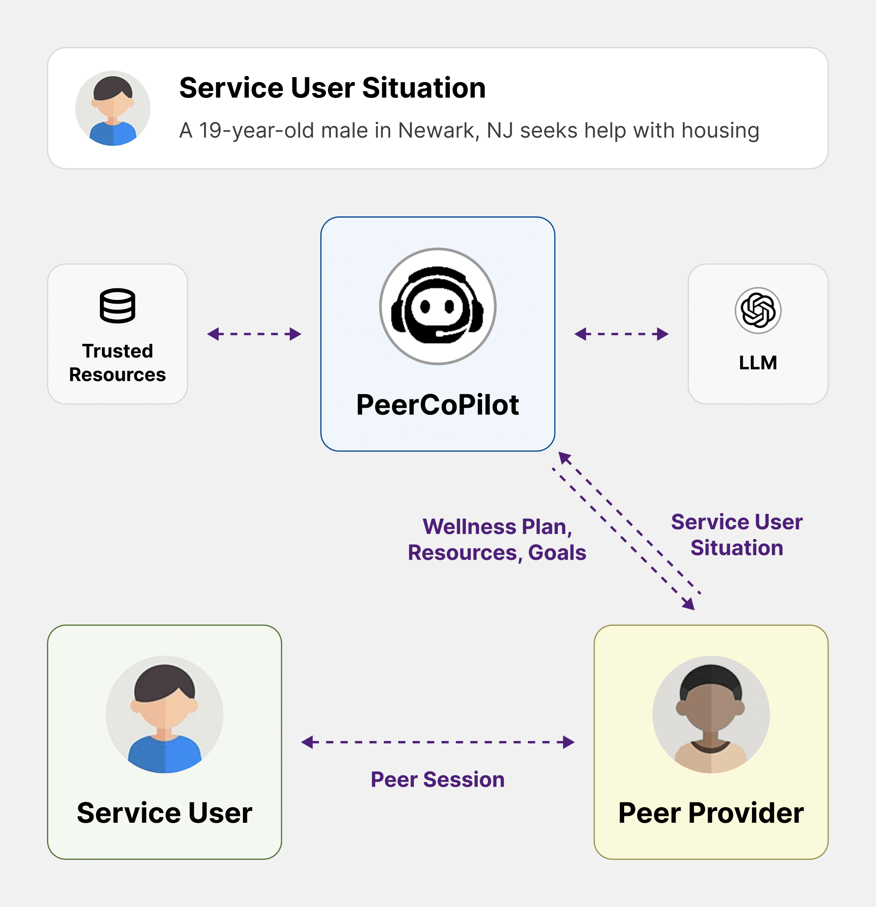

# PeerCopilot: A Language Model-Powered Assistant for Behavioral Health Organizations
<p align="center">
    
</p>

This repository contains the implementation for the paper **"PeerCopilot: A Language Model-Powered Assistant for Behavioral Health Organizations"**.

This work was done by Gao Mo*, Naveen Raman*, Megan Chai, Cindy Peng, Shannon Pagdon, Nev Jones, Hong Shen, Peggy Swarbrick, Fei Fang.

**TL;DR**

Peer-run behavioral health organizations offer holistic wellness support by combining mental health services with assistance for needs such as housing, employment, and income. However, staffing and expertise limitations hinder behavioral health organizations, making meeting all service user needs difficult. We address this issue through PeerCoPilot, a large language model (LLM)-powered assistant that helps peer providers create wellness plans, construct step-by-step goals, and find resources for these goals. Because information reliability is critical for peer providers, we designed PeerCoPilot to rely on information verified by peer providers via retrieval augmented generation. We conducted human evaluations with 15 peer providers and 6 service users and found that both groups overwhelmingly supported using PeerCoPilot. We show that PeerCoPilot provides more reliable and specific information than a baseline LLM. PeerCoPilot is now used by a group of peer providers at cspnj, a large behavioral health organization serving over 10,000 service users, and we are actively expanding PeerCoPilot's use.  


## Setup

### Backend Installation

To set up the backend environment, first clone this repository:

```bash
git clone https://github.com/naveenr414/community_services_llm.git
```

Then, navigate into the **backend** folder and install the dependencies:

```bash
cd backend
conda env create --file env.yaml
conda activate peer-copilot
```

Finally, create a file called `secret.py` with the following contents: 
```python
new_key = 'sk-proj...'
```

Then in `benefits/generate_response.py`, `mental_health/generate_response.py`, and `resources/generate_response.py`, replace `from secret import naveen_key as key` with `from secret import new_key as key`. 


### Frontend Installation

To set up the frontend, navigate into the **frontend-react** folder and install dependencies using npm:

```bash
cd frontend-react
npm install
```

### Running the Application

After installing dependencies for both the backend and frontend, follow these steps to run the application:

#### Start the backend:
```bash
cd backend
uvicorn all_endpoints:socket_app --reload --port 8000
```

#### Start the frontend:
Open a new terminal and run:
```bash
cd frontend-react
npm start
```

Once both services are running, the tool will be available at:

http://localhost:3000/